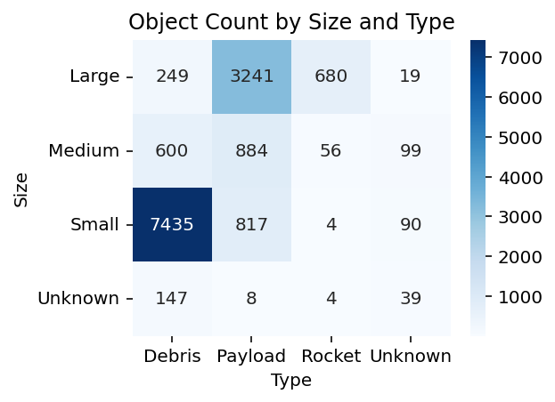
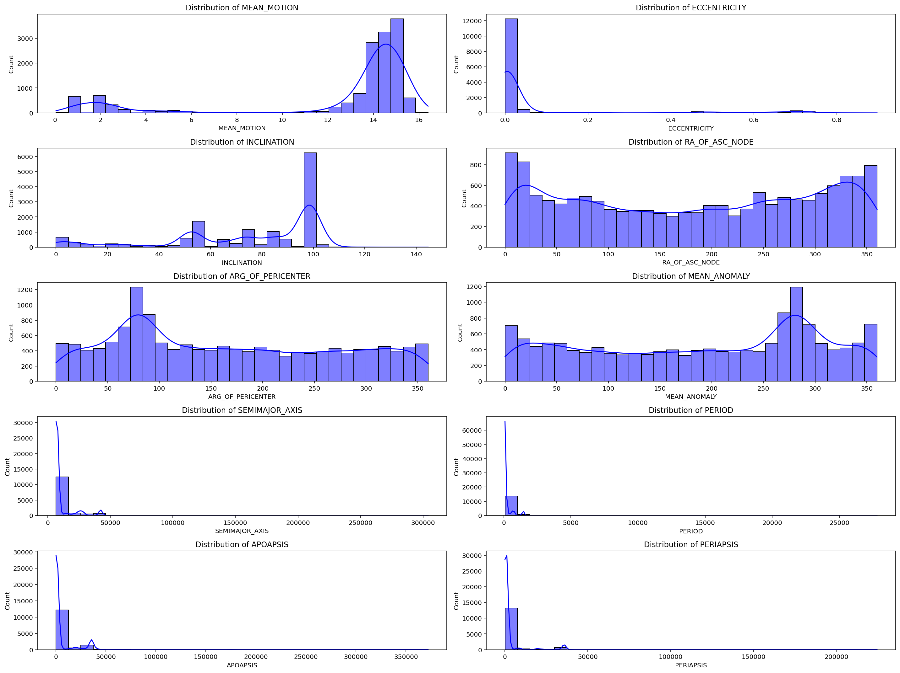
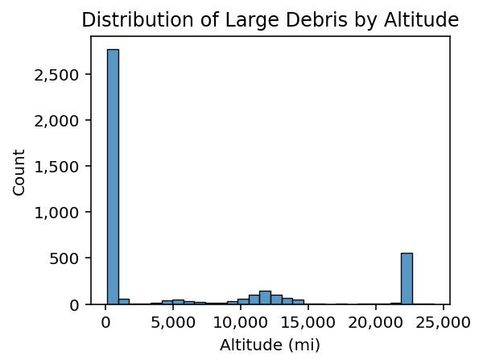
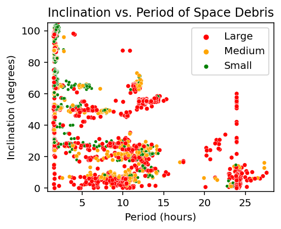
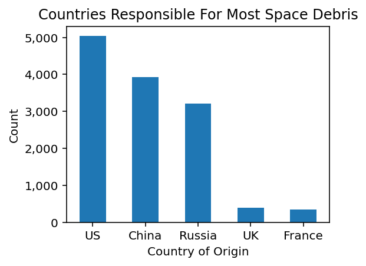
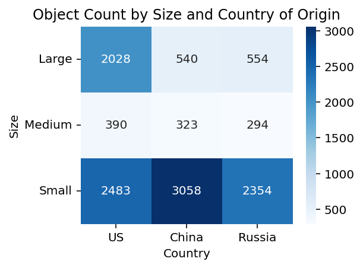
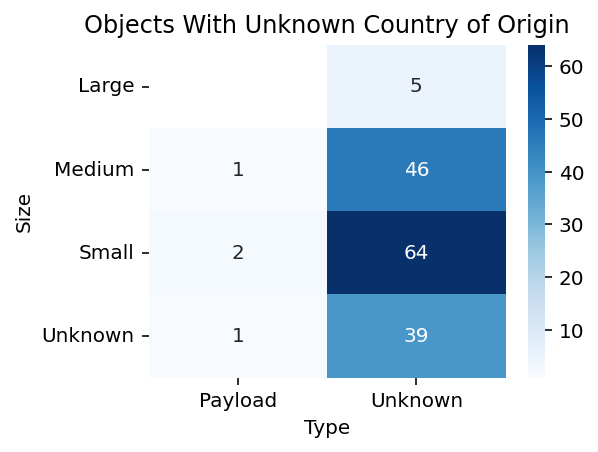
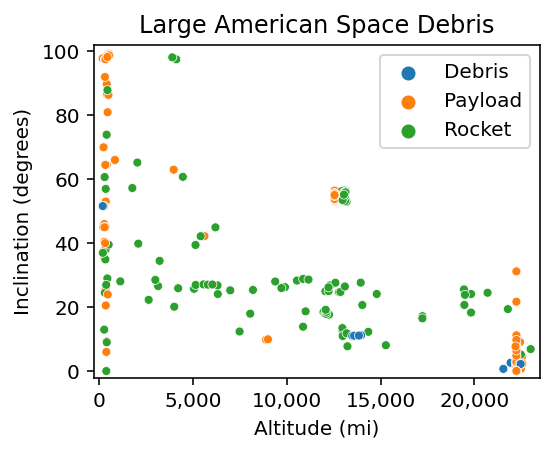
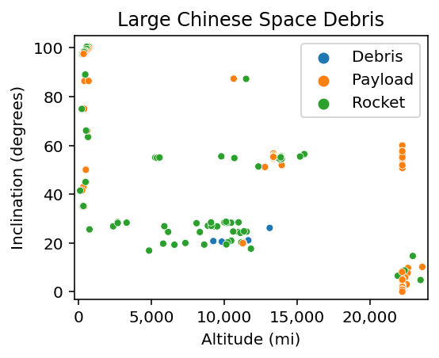
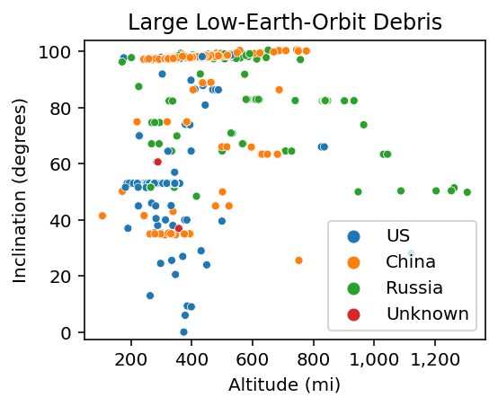

# Orbital Debris Classification and Analysis

### Table of Contents

- [Orbital Debris Classification and Analysis](#orbital-debris-classification-and-analysis)
  - [Table of Contents](#table-of-contents)
  - [Introduction](#introduction)
  - [Project Proposal / Research Questions](#project-proposal--research-questions)
    - [Research Questions](#research-questions)
    - [Objectives](#objectives)
  - [Potential Applications of Findings](#potential-applications-of-findings)
  - [Source of Data](#source-of-data)
  - [Data Integration Challenges and Solutions](#data-integration-challenges-and-solutions)
  - [Exploratory Data Analysis (EDA)](#exploratory-data-analysis-eda)
    - [Feature Categories](#feature-categories)
    - [Key Findings](#key-findings)
  - [Model Selection and Implementation](#model-selection-and-implementation)
    - [Preprocessing Steps](#preprocessing-steps)
    - [Model Development](#model-development)
    - [Model Assessment](#model-assessment)
    - [Results and Interpretation](#results-and-interpretation)
  - [API Documentation](#api-documentation)
    - [Access the API](#access-the-api)
  - [App Hosted on Render](#app-hosted-on-render)
    - [Prediction Endpoint](#prediction-endpoint)
  - [Model Deployment and Usage](#model-deployment-and-usage)
  - [Future Studies](#future-studies)
    - [Trends in Space Launches](#trends-in-space-launches)
    - [Space Debris](#space-debris)
    - [Technological Advancements](#technological-advancements)
  - [Citations](#citations)

## Introduction

This project focuses on classifying and predicting the status of artificial space objects (ASOs), with an emphasis on orbital debris. Utilizing machine learning techniques, the goal is to accurately categorize these objects as either payloads or non-payloads, based on their orbital and physical characteristics.

## Project Proposal / Research Questions

### Research Questions

**Can orbital parameters and physical characteristics be used to classify an artificial space object (ASO) as a payload or non-payload?**
   - Examination of features like inclination, period, altitude, and others to predict the classification of ASOs.
   - Assessing the model’s accuracy in distinguishing between payloads and various types of non-payloads.


### Objectives

- **Classify ASOs based on their orbital and physical characteristics:**
  - Develop a machine learning model that accurately classifies ASOs as payloads or non-payloads.
- **Predict the status of non-payload objects:**
  - Enhance the classification model to differentiate between debris, rockets, and unknown objects.

## Potential Applications of Findings

- **Space Traffic Management:**
  - Improve collision avoidance systems by accurately classifying space objects and predicting potential risks.
- **Satellite and Mission Planning:**
  - Provide insights for future satellite design and deployment, optimizing for longevity and reducing debris generation.
- **Policy Development:**
  - Inform policies and regulations to promote the sustainable use of space by understanding the distribution and classification of space debris.

## Source of Data

https://www.kaggle.com/datasets/kandhalkhandeka/satellites-and-debris-in-earths-orbit


- **Data Source:**
  - CSV file containing historical records of ASOs, including their launch date, inclination, period, altitude, eccentricity, and more.

## Data Integration Challenges and Solutions

- **Challenges:**
  - Handling missing or incomplete data in various records.
  - Standardizing data from different time periods and ensuring consistency in classification.

- **Solutions:**
  - Applied data cleaning techniques to fill in missing values using appropriate methods (e.g., mean imputation).
  - Standardized the data to ensure compatibility and consistency across different records.

## Exploratory Data Analysis (EDA)

### Feature Categories

- **Orbital Parameters:**
  - Inclination, period, altitude, eccentricity, etc.
- **Physical Characteristics:**
  - RCS size, semimajor axis, etc.

### Key Findings

- **Correlation Between Object Size and Type:**
  - A heatmap analysis shows the relationship between object size (Small, Medium, Large) and object type (Debris, Payload, Rocket), highlighting the prevalence of larger debris objects.



- **Statistical Summary of Orbital Elements:**
  - Descriptive statistics for key orbital elements like eccentricity, inclination, and period provide insights into the characteristics of different types of objects.





- **Distribution of Large Debris by Altitude:**
  - Large debris objects tend to have a wide distribution in altitude, with many concentrated at lower altitudes.



- **Inclination vs. Period Analysis:**
  - Scatter plots reveal the relationship between inclination and period for different object sizes, showing distinct clusters for large, medium, and small objects.

  

- **Top Contributing Countries:**
  - The United States, China, and Russia are the primary contributors to space debris, with the US responsible for a significant portion (~40%).

  

- **Object Count by Country and Size:**
  - A heatmap shows the distribution of objects by size and country of origin, indicating that the US, China, and Russia dominate in all size categories.



- **Unknown Origin Objects:**
  - There are a notable number of debris objects with unknown country origins, which are mostly large or medium-sized.



- **Large Debris by Country:**
  - Scatter plots focus on large debris from the US and China, showing their respective altitudes and inclinations.

  
  

- **Large Low-Earth-Orbit (LEO) Debris:**
  - LEO debris from the US, China, Russia, and unknown origins are analyzed, revealing distinct patterns in altitude and inclination.



## Model Selection and Implementation

### Preprocessing Steps

1. **Data Cleaning:**
   - Unnecessary columns (e.g., `DECAY_DATE`) were removed from the dataset.
   - Missing values in categorical columns were filled with "Unknown" or appropriate labels.
   - New columns `PERIOD_HOURS` and `ALTITUDE_MI` were created to provide more meaningful features for the model.

2. **Feature Engineering:**
   - Categorical variables, such as `COUNTRY_CODE` and `RCS_SIZE`, were encoded using `LabelEncoder`.
   - Polynomial features were added to capture interactions between the original features, enhancing the model’s ability to learn complex patterns.

3. **Handling Class Imbalance:**
   - To address the imbalance between payload and non-payload classes, the dataset was resampled using SMOTE (Synthetic Minority Over-sampling Technique).

4. **Feature Scaling:**
   - StandardScaler was applied to standardize the features, ensuring that they contribute equally to the model’s predictions.

### Model Development

- **Model Choice:**
  - A Logistic Regression model was chosen due to its simplicity and effectiveness in binary classification tasks. The model was configured with a maximum of 1000 iterations (`max_iter=1000`) and class weights were balanced (`class_weight='balanced'`) to handle the imbalance in the dataset.

- **Hyperparameter Tuning:**
  - A grid search (`GridSearchCV`) was performed over a range of hyperparameters, specifically varying the regularization strength (`C`) and the solver (`solver`). The goal was to find the optimal combination that maximizes the model’s F1 score.

- **Best Model Selection:**
  - The best model was selected based on the highest F1 score obtained from cross-validation. The optimal parameters found were `C=100` and `solver='liblinear'`.

### Model Assessment

- **Performance Metrics:**
  - The model’s performance was evaluated using classification metrics such as precision, recall, and F1-score. The results indicated that the model performed well in classifying payloads and non-payloads.

### Results and Interpretation

- **Strengths:**
  - The Logistic Regression model effectively classified payloads with high accuracy.
- **Areas for Improvement:**
  - The classification of non-payload subcategories could be enhanced in future iterations of the model.

- **Model Persistence:**
  - The trained model, along with the polynomial feature transformer and scaler, were saved as `best_logreg_model.pkl`, `poly_transformer.pkl`, and `scaler.pkl` respectively, for future use in the API.

## API Documentation

The project includes a FastAPI-based web service that allows users to input ASO characteristics and receive predictions on their classification.

### Access the API

The API can be accessed and tested via the following link:

- **Swagger UI:** [API Documentation and Testing](https://orbital-debris-categorization-and-yg2z.onrender.com/docs)

Users can input orbital parameters and physical characteristics to receive a prediction on whether the object is a payload or non-payload and what size it is whether it is small, medium, or large.

## App Hosted on Render

This project includes a FastAPI application hosted on Render.

### Prediction Endpoint

- **Endpoint:** `/predict`
- **Method:** `POST`
- **Request Body:** A JSON object containing the ASO's characteristics (e.g., `INCLINATION`, `ALTITUDE_MI`, `ECCENTRICITY`, etc.). The required fields are those that were determined to be most predictive during the model development phase.

  **Example JSON:**
  ```json
  {
    "INCLINATION": 98.7,
    "ALTITUDE_MI": 450,
    "ECCENTRICITY": 0.001,
    "RA_OF_ASC_NODE": 120.5,
    "ARG_OF_PERICENTER": 75.3,
    "MEAN_ANOMALY": 5.6,
    "SEMIMAJOR_AXIS": 6878.1,
    "PERIOD_HOURS": 1.5,
    "APOAPSIS": 6879.5,
    "PERIAPSIS": 6876.7
  }

- **Response:** The API will return a JSON response indicating the predicted classification (Payload/Non-Payload) and, if non-payload, further classification into Debris, Rocket, or Unknown, as well as the object's size category (Small, Medium, Large).

  **Example Response:**
  ```json
  {
    "classification": "Non-Payload",
    "subclassification": "Debris",
    "size": "Large"
  }

## Model Deployment and Usage

To utilize the deployed model via the API, follow these steps:

- Access the API Documentation: You can access the interactive Swagger UI by navigating to the [API Documentation and Testing page](https://orbital-debris-categorization-and-yg2z.onrender.com/docs#/default/predict_predict_post). Here, you can test the /predict endpoint with different inputs.

- Submit Predictions: Users can use tools like Postman or cURL, or directly use the Swagger UI to submit a POST request to the /predict endpoint with the required JSON payload.

- Interpret Results: The API will return the classification results, which can then be used for further analysis or decision-making processes, such as space traffic management or policy development.

## Future Studies

The findings from this project open up several avenues for future research and applications in space object classification and orbital debris management:

### Trends in Space Launches

Analysis of Launch Trends: Investigating how launch frequency and technological advancements influence the creation and categorization of space debris over time.

Predicting Future Debris: Developing predictive models that can estimate future debris accumulation based on current launch trends and debris mitigation strategies.

### Space Debris
Mitigation Strategies: Exploring and assessing the effectiveness of various debris mitigation strategies, including active debris removal (ADR) and passivation techniques.

Collision Risk Assessment: Enhancing collision prediction models by incorporating the classification data to improve the accuracy of conjunction analyses and collision avoidance maneuvers.

### Technological Advancements
Impact of New Technologies: Studying the impact of new satellite technologies and miniaturization on debris generation, including the rise of mega-constellations and CubeSats.

## Citations
- **Khandeka, K.**, "Satellites and Debris in Earth's Orbit," Kaggle Dataset. Available at: [Kaggle](https://www.kaggle.com/datasets/kandhalkhandeka/satellites-and-debris-in-earths-orbit)

- **TSgt Eric Baldwin**, 937-789-0108, Eric.Baldwin.1@spaceforce.mil

- **GITHUB** - https://github.com/Eric-Baldwin/Orbital_Debris_Categorization_and_Analysis

- **APP URL** - https://orbital-debris-categorization-and-yg2z.onrender.com/docs
